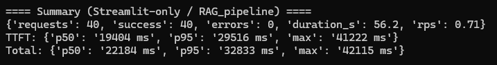
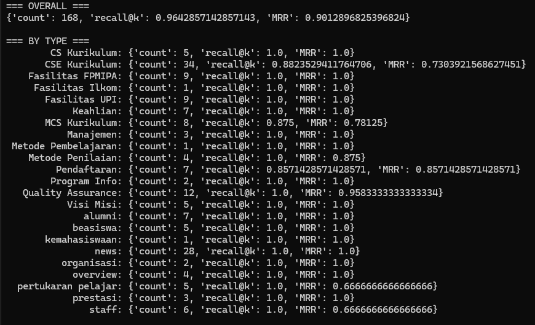

# Chatbot CSE UPI

A **Streamlit chatbot** for the Faculty of Computer Science Education, Universitas Pendidikan Indonesia: [https://cs.upi.edu/v2/](https://cs.upi.edu/v2/)  

This chatbot answers questions about **history**, **vision, mission, and objectives**, **staff**, **news**, **curriculum**, **examinations**, **students**, **alumni**, **admissions**, **quality assurance**, **facilities**, and **research groups**.  

Under the hood, it uses **RAG** with **two retrieval modes**:  

- **Dense** (semantic search) for meaning.  
- **Sparse** (keyword search) for exact matches.  

Results are fused with **FFR** (fusion of dense & sparse), then **reranked** by **Qwen3-Reranker-8B** for the final answer.  

We use **Qwen3-Embedding-8B** + **Qwen3-Reranker-8B** because they rank at the top of the **MTEB leaderboard**:  
👉 [https://huggingface.co/spaces/mteb/leaderboard](https://huggingface.co/spaces/mteb/leaderboard)


---

## Requirements

- Python **3.10+**
- Accounts/keys for:
  - **Pinecone** (vector DB)
  - **SiliconFlow** (Qwen3 embeddings + reranker)
  - **OpenAI** (LLM)
  - (Optional) **Gemini** (embedding for semantic chunks)
- (Optional) **Docker** if you prefer containers

---

## Environment Variables (`.env`)

Copy `.env.example` and rename it to `.env` in the project root and fill it.

**What these do:**

| Variable                    | Purpose                                                    |
| --------------------------- | ---------------------------------------------------------- |
| `SILICONFLOW_API_KEY`       | Auth for SiliconFlow (embeddings + reranker).              |
| `SILICONFLOW_URL_EMBEDDING` | Endpoint for embeddings (`https://api.siliconflow.com/v1/embeddings`). |
| `SILICONFLOW_URL_RERANK`    | Endpoint for reranking (`https://api.siliconflow.com/v1/rerank`).     |
| `PINECONE_API_KEY`          | Auth for Pinecone.                                         |
| `HOST_PINECONE_DENSE`       | Pinecone **dense** index host (semantic vectors).          |
| `HOST_PINECONE_SPARSE`      | Pinecone **sparse** index host (keyword vectors).          |
| `NAMESPACE`                 | Pinecone namespace for your dataset (e.g., `cse-upi-v2`).  |
| `EMBED_DIM`                 | Embedding dimension (e.g., 1024 for Qwen3-Embedding-8B).   |
| `OPENAI_API_KEY`            | Auth for OpenAI (generation).                              |
| `GOOGLE_API_KEY`            | Auth for Gemini (optional).                                |

---

## Data

- `data/final_id` → JSON knowledge base (source of truth).  
  Ingested by `setup_pinecone.py` to build embeddings and insert into Pinecone.  
- `data/eval` → JSON evaluation data for RAG evaluation.  
  Metrics: **Recall@k**, **MRR (Mean Reciprocal Rank)**, and **ROUGE-L** for generation.

---

## Setup & Run

### **1️⃣ Using Python (local development)**

1. **Install & set env**

```bash
python -m venv venv
# source venv/bin/activate          # macOS/Linux
venv\Scripts\activate           # Windows
pip install -r requirements.txt
```

2. **Create vector DB & insert data**

```bash
python setup_pinecone.py
```

3. **Start the chatbot**

```bash
streamlit run web_chatbot.py
```

Open: [http://localhost:8501](http://localhost:8501)

---

### **2️⃣ Using Docker**

### Option A: Use your local code + env

```bash
docker build -t <image-name> .
docker run -d \
  --name <container-name> \
  --restart unless-stopped \
  --env-file .env \
  -p 8501:8501 \
  <image-name>
```

### Option B: Pull the prebuilt image

```bash
docker pull bwbayu/chatbot-cse-upi:v0.1
docker run -d \
  --name <container-name> \
  --restart unless-stopped \
  --env-file .env \
  -p 8501:8501 \
  bwbayu/chatbot-cse-upi:v0.1
```

### Option C (cleanest): docker-compose

Run:

```bash
docker compose up -d
```

---

## Retrieval Pipeline

`search.py` implements the retrieval stack:

- **Query classification** → filter metadata for semantic + keyword search.  
- **Dense search** → Pinecone dense index (Qwen3-Embedding-8B).  
- **Sparse search** → Pinecone sparse index (BM25).  
- **FFR fusion** → merge dense + sparse results.  
- **Reranking** → Qwen3-Reranker-8B.  
- **Generation** → final AI response based on query, retrieval context, and history.

---

## Project Structure

```
.
├── data/                   # Knowledge base & evaluation data
├── data/final_id           # JSON knowledge base (source of truth)
├── data/eval               # JSON evaluation data
├── setup_pinecone.py       # Builds embeddings, creates Pinecone indices, trains BM25
├── search.py               # Retrieval + fusion + rerank + generation (RAG pipeline)
├── web_chatbot.py          # Streamlit chatbot UI
├── evals.py                # Evaluation framework (see below)
├── bench_streamlit_only.py # Benchmarking tool for RAG pipeline (see below)
├── requirements.txt        # Dependencies
├── Dockerfile              # Container build
├── .env                    # Secrets (ignored in git)
└── README.md
```

### 🔹 `bench_streamlit_only.py`

This script is a **benchmarking utility** designed to stress-test the **RAG pipeline** (without Streamlit UI).  

It measures:  
- **TTFT (Time-To-First-Token)**  
- **Total response latency**  
- **Token throughput**  
- **Error rates & timeouts**  

How it works:  
- Uses a pool of worker threads (`ThreadPoolExecutor`) to send multiple concurrent queries.  
- Queries are randomly sampled from a predefined set (`QUERIES`).  
- For each query, it streams results from `RAG_pipeline` and records latency + tokens processed.  
- Provides aggregated stats (p50, p95, max) for both **TTFT** and **Total Latency**.  
- Reports **success count**, **error samples**, and **RPS (requests per second)**.  

Usage example:

```bash
python bench_streamlit_only.py --concurrency 40 --requests 40 --timeout 60
```

Output sample:



This is crucial for validating **scalability** and **latency performance** before deployment.

---

### 🔹 `evals.py`

This script is the **evaluation framework** for the RAG pipeline. It measures **retrieval quality** and optionally **generation quality**.

It evaluates on a dataset (`data/eval/*.json`) with **gold-standard queries and answers**.

Metrics:  
- **Recall@k** → Fraction of queries where at least one gold document appears in top-k results.  
- **MRR (Mean Reciprocal Rank)** → Rewards higher-ranked gold docs.  
- **ROUGE-L** → (Optional) Measures similarity between generated and gold answers.

How it works:  
1. Runs retrieval with **dense + sparse search**, fusion, and reranking.  
2. Compares retrieved docs against gold IDs.  
3. (Optional) Runs generation (`context_generation`) and computes **ROUGE-L** vs gold answers.  
4. Reports **overall metrics** + **per-type metrics** (if queries are labeled by type).  
5. Can save augmented evaluation data (with retrieved IDs and generated answers) back to JSON.

Usage example:

```bash
python evals.py
```

Output sample:



This script is essential for validating **retrieval accuracy** and **answer quality** before production.

---

## Example Questions

* “Apa visi dan misi Departemen Ilmu Komputer UPI?”
* “Sejarah singkat Ilmu Komputer UPI?”
* “Kelompok riset apa saja yang ada?”
* “Fasilitas laboratorium apa yang tersedia?”
* “Struktur kurikulum program X?”

---

## License

MIT License — free to use, modify, and distribute.

---