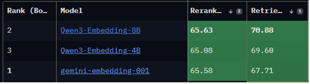

# Chatbot CSE UPI

A **Streamlit chatbot** for the Faculty of Computer Science Education, Universitas Pendidikan Indonesia: [https://cs.upi.edu/v2/](https://cs.upi.edu/v2/)
Ask it about **history**, **vision**, **mission**, **objectives**, **curriculum**, **facilities**, and **research groups**.
Under the hood it uses **RAG** with **two retrieval modes**:

* **Dense** (semantic search) for meaning.
* **Sparse** (keyword search) for exact matches.

Results are fused with **FFR** (fusion of dense & sparse), then **reranked** by **Qwen3-Reranker-8B** for the final answer.

We use **Qwen3-Embedding-8B** + **Qwen3-Reranker-8B** because they’re top-tier on the **MTEB leaderboard**. See: [https://huggingface.co/spaces/mteb/leaderboard](https://huggingface.co/spaces/mteb/leaderboard).


---

## Requirements

* Python **3.10+**
* Accounts/keys for:

  * **Pinecone** (vector DB)
  * **SiliconFlow** (Qwen3 embeddings + reranker)
  * **OpenAI** (LLM)
* (Optional) **Docker** if you prefer containers

---

## Environment Variables (`.env`)

Copy `.env.example` and rename it to `.env` in the project root and fill it.

**What these do:**

| Variable                    | What it’s for                                             |
| --------------------------- | --------------------------------------------------------- |
| `SILICONFLOW_API_KEY`       | Auth for SiliconFlow (embeddings + reranker).             |
| `SILICONFLOW_URL_EMBEDDING` | Endpoint for embedding model (https://api.siliconflow.com/v1/embeddings)                          |
| `SILICONFLOW_URL_RERANK`    | Endpoint for rerank model (https://api.siliconflow.com/v1/rerank)                           |
| `PINECONE_API_KEY`          | Auth for Pinecone.                                        |
| `HOST_PINECONE_DENSE`       | Pinecone **dense** index host (semantic vectors).         |
| `HOST_PINECONE_SPARSE`      | Pinecone **sparse** index host (keyword vectors).         |
| `NAMESPACE`                 | Pinecone namespace for your dataset (e.g., `cse-upi-v2`). |
| `EMBED_DIM`                 | Embedding dimension (must match your model, I use 1024).              |
| `OPENAI_API_KEY`            | Auth for OpenAI (generation).                             |

---

## Data

* `data/` contains the **JSON knowledge base** used to build the retrieval model.
  These files are ingested by `main.py` to generate embeddings and insert them into the Pinecone vector database.

---

## Setup & Run

### **1️⃣ Using Python (local development)**

1. **Install & set env**

```bash
python -m venv venv
# source venv/bin/activate          # macOS/Linux
venv\Scripts\activate           # Windows
pip install -r requirements.txt
```

2. **Create vector DB & insert data**

```bash
python main.py
```

3. **Start the chatbot**

```bash
streamlit run web_chatbot.py
```

Open: [http://localhost:8501](http://localhost:8501)

---

### **2️⃣ Using Docker**

### Option A: Use your local code + env

```bash
docker build -t <image-name> .
docker run -d \
  --name <container-name> \
  --restart unless-stopped \
  --env-file .env \
  -p 8501:8501 \
  <image-name>
```

### Option B: Pull the prebuilt image

```bash
docker pull bwbayu/chatbot_cse_upi:v0
docker run -d \
  --name <container-name> \
  --restart unless-stopped \
  --env-file .env \
  -p 8501:8501 \
  bwbayu/chatbot_cse_upi:v0
```

### Option C (cleanest): docker-compose

Run:

```bash
docker compose up -d
```

---

## Retrieval Pipeline (how it works)

* `search.py` implements the retrieval stack:
  * **Dense** semantic search (Qwen3-Embedding-8B → Pinecone dense index).
  * **Sparse** keyword search (Pinecone sparse index).
  * **FFR fusion** to combine dense + sparse results.
  * **Qwen3-Reranker-8B** to rerank final candidates.
* `web_chatbot.py` wires this into a Streamlit chat UI.
* `main.py` prepares indices + ingests `data/`.

---

## Project Structure

```
.
├── data/                 # JSON knowledge base (source of truth)
├── main.py               # Builds embeddings, creates Pinecone indices, upserts
├── search.py             # Dense+Sparse retrieval, FFR fusion, reranking
├── web_chatbot.py        # Streamlit chatbot UI
├── requirements.txt      # Python deps
├── Dockerfile            # Container build
├── .env                  # Secrets (local only; not committed)
└── README.md
```

---

## Example Questions

* “Apa visi dan misi Departemen Ilmu Komputer UPI?”
* “Sejarah singkat Ilmu Komputer UPI?”
* “Kelompok riset apa saja yang ada?”
* “Fasilitas laboratorium apa yang tersedia?”
* “Struktur kurikulum program X?”

---

## License

MIT License — free to use, modify, and distribute.

---